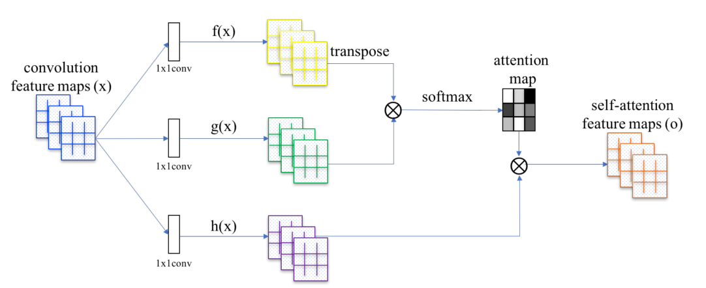

# 深度特征融合

## 1. 特征融合的分类

### 1.1 早融合（early fusion）

 先融合多层的特征，然后**在融合后的特征上训练**预测器（只在完全融合之后，才统一进行检测）。又被称为skip connection。分为**add**与**concat**。

（1）concat：系列特征融合，直接将两个特征进行连接。两个输入特征x和y的维数若为p和q，输出特征z的维数为$p+q$；
 （2）add：并行策略，将这两个特征向量组合成复向量，对于输入特征x和y，$z = x + iy$，其中$i$是虚数单位。

### 1.2 晚融合（late fusion）

通过结合不同层的检测结果改进检测性能（尚未完成最终的融合之前，在部分融合的层上就开始进行检测，会有多层的检测，最终将多个检测结果进行融合）。分为**多尺度预测**和**特征金字塔融合**。
（1）feature不融合，多尺度的feture分别进行预测，然后对预测结果进行综合，如Single Shot MultiBox Detector (SSD) , Multi-scale CNN(MS-CNN)
（2）feature进行金字塔融合，融合后进行预测，如Feature Pyramid Network(FPN)等。

参考博客：

1. [深度特征融合---高低层特征融合](https://blog.csdn.net/xys430381_1/article/details/88370733)

## 2. 多层特征融合： add与concat

### 2.1 add

典型例子：ResNet，FCN

add是特征值相加，通道数 不变，要求操作前的两tensor维度一致。

### 2.2 concat

典型例子：DenseNet

concat是做通道的合并。

### 2.3 对比

concatenate操作的计算量要更大，使用add可以节省计算量；但是在时序网络中add没法替代concatenate。

**add可以认为是特殊的concat形式。但是add的计算量要比concat的计算量小得多。**

### 附录

参考博客：

1. [神经网络中通过add和concate（cat）的方式融合特征的不同](https://blog.csdn.net/weixin_42926076/article/details/100660188)
2. [深度特征融合---理解add和concat之多层特征融合](https://blog.csdn.net/xys430381_1/article/details/88355956)

```python
# 组合池化（分别使用add和concat）
def add_avgmax_pool2d(x, output_size=1):
    x_avg = F.adaptive_avg_pool2d(x, output_size)
    x_max = F.adaptive_max_pool2d(x, output_size)
    return 0.5 * (x_avg + x_max)
 
def cat_avgmax_pool2d(x, output_size=1):
    x_avg = F.adaptive_avg_pool2d(x, output_size)
    x_max = F.adaptive_max_pool2d(x, output_size)
    return torch.cat([x_avg, x_max], 1)
# 原文链接：https://blog.csdn.net/weixin_42926076/article/details/100660188
```


## 3. attention

### 3.1 SA-GAN



### 3.2 SENet (Squeeze-and-Excitation Networks, CVPR2018)

具体来讲，SENet是一种卷积结构，将feature map 先压缩，后激励。
**压缩Sequeeze**
 通过global pooling ，在channel 维出一个$1\times1\times C$的tensor。然后通过一个bttleneck结构。$ 1 \times 1 \times C $ 变为 $ 1 \times 1 \times \frac{C}{r}$ 通过relu激活再变为$ 1\times 1\times C$。这个$r$可以是4或者16，$r=4$ 在imageNet 上的 image-top1 err 最低为22.25%，$r=16$ 在imageNet 上的 image-top1 err 最低为6.03%，backbone 为ResNet-50。通过bttleneck有两个好处，1是减少模型复杂性，2是增加泛化性。
 **激励exciation**

$1\times1\times C$的tensor最终会通过sigmoid函数，表示每一维channel具有的信息的价值的差异，然后与原始张量channel维相乘。

### 3.3 Non-local neural Networks (CVPR2018)

non-local是在point-wise方面做attention的。卷积操作的核心在于权重共享和局部相应。

具体来说把一个张量转置后与自身做矩阵相乘，这样每一个像素位置都融合了其他位置的信息。然后通过softmax激活channel维的张量。同时，输入张量会通过三个不同的$1\times1\times1$的卷积层，然后在出口再经过$1 \times 1 \times 1$的卷积层，恢复为原来的channel维数。其实仍然具有一个bottleneck 结构。最后的结果与原始张量相加。

### 附录

```python
# 1. SA-GAN核心代码
##############################
# self attention layer
# author Xu Mingle
# time Feb 18, 2019
##############################
import torch.nn.Module
import torch
import torch.nn.init
def init_conv(conv, glu=True):
    init.xavier_uniform_(conv.weight)
    if conv.bias is not None:
        conv.bias.data.zero_()

class SelfAttention(nn.Module):
    r"""
        Self attention Layer.
        Source paper: https://arxiv.org/abs/1805.08318
    """
    def __init__(self, in_dim, activation=F.relu):
        super(SelfAttention, self).__init__()
        self.chanel_in = in_dim
        self.activation = activation
        
        self.f = nn.Conv2d(in_channels=in_dim, out_channels=in_dim // 8 , kernel_size=1)
        self.g = nn.Conv2d(in_channels=in_dim, out_channels=in_dim // 8 , kernel_size=1)
        self.h = nn.Conv2d(in_channels=in_dim, out_channels=in_dim , kernel_size=1)
        
        self.gamma = nn.Parameter(torch.zeros(1))

        self.softmax  = nn.Softmax(dim=-1)

        init_conv(self.f)
        init_conv(self.g)
        init_conv(self.h)
        
    def forward(self, x):
        """
            inputs :
                x : input feature maps( B X C X W X H)
            returns :
                out : self attention feature maps
                
        """
        m_batchsize, C, width, height = x.size()
        
        f = self.f(x).view(m_batchsize, -1, width * height) # B * (C//8) * (W * H)
        g = self.g(x).view(m_batchsize, -1, width * height) # B * (C//8) * (W * H)
        h = self.h(x).view(m_batchsize, -1, width * height) # B * C * (W * H)
        
        attention = torch.bmm(f.permute(0, 2, 1), g) # B * (W * H) * (W * H)
        attention = self.softmax(attention)
        
        self_attetion = torch.bmm(h, attention) # B * C * (W * H)
        self_attetion = self_attetion.view(m_batchsize, C, width, height) # B * C * W * H
        
        out = self.gamma * self_attetion + x
        return out

# 原文链接：https://blog.csdn.net/qq_27261889/article/details/87626592

# 2. Non-local network核心代码
    def forward(self, x):
        '''
        :param x: (b, c, t, h, w)
        :return:
        '''

        batch_size = x.size(0)

        g_x = self.g(x).view(batch_size, self.inter_channels, -1)
        g_x = g_x.permute(0, 2, 1)

        theta_x = self.theta(x).view(batch_size, self.inter_channels, -1)
        theta_x = theta_x.permute(0, 2, 1)
        phi_x = self.phi(x).view(batch_size, self.inter_channels, -1)
        f = torch.matmul(theta_x, phi_x)
        f_div_C = F.softmax(f, dim=-1)

        y = torch.matmul(f_div_C, g_x)
        y = y.permute(0, 2, 1)
        y = y.reshape(batch_size, self.inter_channels, *x.size()[2:])
        W_y = self.W(y)
        z = W_y + x

        return z
# 原文链接：https://blog.csdn.net/Arron_hou/article/details/95676716
```

